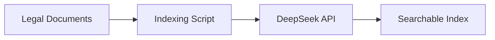
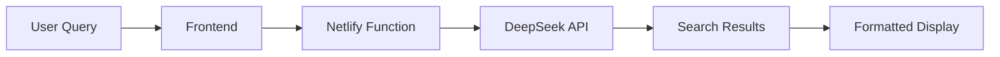

# 🏇 ITPF Legal Query System

A modern, bilingual web application for querying legal documents of the International Tent Pegging Federation (ITPF). Search legal texts in both Arabic and English with AI-powered intelligent search.


## ✨ Features

- **🌐 Bilingual Support**: Seamlessly switch between Arabic (RTL) and English (LTR)
- **🔍 AI-Powered Search**: DeepSeek API integration for intelligent legal document search
- **📱 Responsive Design**: Works perfectly on desktop, tablet, and mobile devices
- **⚡ Fast & Reliable**: Hosted on Netlify with global CDN
- **🎯 Accurate Results**: Contextual search with relevance scoring
- **♿ Accessible**: WCAG compliant with keyboard navigation support
- **🔒 Secure**: Environment-based API key management and XSS protection

## 🚀 Live Demo

**Website**: `https://your-site-name.netlify.app`

Try searching for:
- English: "What are the rules for tent pegging competitions?"
- Arabic: "ما هي قوانين مسابقات التقاط الأوتاد؟"

## 🛠 Technology Stack

### Frontend
- **HTML5**: Semantic, accessible markup
- **CSS3**: Modern styling with CSS Grid and Flexbox
- **JavaScript**: ES6+ with modern browser APIs
- **Fonts**: Google Fonts (Inter + Noto Sans Arabic)

### Backend
- **Netlify Functions**: Serverless Node.js functions
- **DeepSeek API**: AI-powered search and indexing
- **HTTPS**: Automatic SSL with custom domain support

### Development
- **Git**: Version control
- **Node.js**: Runtime and tooling
- **Netlify CLI**: Local development and deployment

## 📁 Project Structure

```
itpf-legal-query/
├── 🏠 index.html                 # Main application page
├── 🎨 style.css                  # Responsive styles
├── ⚡ app.js                     # Frontend functionality
├── ⚙️ netlify.toml               # Netlify configuration
├── 📦 package.json               # Node.js configuration
├── 🔧 indexing_script.js         # One-time document indexing
├── 📄 arabic_rules.json          # Arabic legal documents
├── 📄 english_rules.json         # English legal documents
├── 🌐 netlify/functions/
│   └── searchFunction.js         # Search API endpoint
├── 📖 DEPLOYMENT_GUIDE.md        # Comprehensive deployment guide
└── 📋 README.md                  # This file
```

## 🏃‍♂️ Quick Start

### Prerequisites
- Node.js 18+
- DeepSeek API key
- Git

### 1. Clone & Setup
```bash
git clone https://github.com/your-username/itpf-legal-query.git
cd itpf-legal-query
npm install -g netlify-cli
```

### 2. Configure Environment
```bash
# Set your DeepSeek API key
export DEEPSEEK_API_KEY="your-api-key-here"
```

### 3. Index Legal Documents
```bash
# Run the one-time indexing script
node indexing_script.js
```

### 4. Deploy to Netlify
```bash
netlify login
netlify init
netlify env:set DEEPSEEK_API_KEY "your-api-key"
netlify deploy --prod
```

📚 **For detailed deployment instructions, see [DEPLOYMENT_GUIDE.md](DEPLOYMENT_GUIDE.md)**

## 🔍 How It Works

### 1. Document Indexing


### 2. Search Flow


## 🌐 API Reference

### Search Endpoint
```http
POST /.netlify/functions/searchFunction
Content-Type: application/json

{
  "query": "What is tent pegging?",
  "language": "en"
}
```

### Response Format
```json
{
  "success": true,
  "hasResults": true,
  "message": "Found 3 relevant results",
  "results": [
    {
      "id": "result_1",
      "title": "Article 100: General",
      "content": "Tent Pegging rules have been created...",
      "score": 95,
      "source": {
        "article": "Article 100",
        "section": "General",
        "document": "ITPF Legal Rules"
      }
    }
  ]
}
```

## 🎨 Customization

### Adding New Languages
1. Update HTML lang attributes
2. Add language fonts to CSS
3. Extend JavaScript language switching
4. Update API to handle new language codes

### Styling Changes
- Modify CSS custom properties in `:root`
- Responsive breakpoints in media queries
- Arabic RTL support in `[dir="rtl"]` selectors

### Adding Features
- User authentication
- Search history
- Bookmarking results
- PDF export functionality

## 🔧 Local Development

### Start Development Server
```bash
# Option 1: Netlify Dev (recommended)
netlify dev

# Option 2: Python HTTP Server
python -m http.server 8000

# Option 3: Node.js HTTP Server
npx http-server
```

### Test Functions Locally
```bash
# Test search function
curl -X POST http://localhost:8888/.netlify/functions/searchFunction \\
  -H "Content-Type: application/json" \\
  -d '{"query": "tent pegging rules", "language": "en"}'
```

## 📊 Performance Optimization

- ⚡ **Loading Speed**: Optimized CSS/JS, WebP images
- 🔄 **Caching**: Browser caching, CDN distribution
- 📱 **Mobile**: Progressive enhancement, responsive design
- ♿ **Accessibility**: ARIA labels, keyboard navigation

## 🔒 Security Features

- 🔐 **API Security**: Environment variables, server-side validation
- 🛡️ **XSS Protection**: HTML escaping, Content Security Policy
- 🔒 **HTTPS**: Automatic SSL, secure headers
- 📝 **Input Validation**: Query length limits, type checking

## 🐛 Troubleshooting

### Common Issues

1. **Search not working**:
   - Check API key configuration
   - Verify documents were indexed
   - Check browser console for errors

2. **Arabic text issues**:
   - Ensure proper font loading
   - Check RTL direction is applied
   - Verify Unicode encoding

3. **Function errors**:
   - Check Netlify function logs
   - Verify environment variables
   - Test API endpoints

### Debug Commands
```bash
# Check function logs
netlify functions:list
netlify functions:invoke searchFunction --payload='{"query":"test","language":"en"}'

# Test locally with debug
NODE_ENV=development netlify dev
```

## 🤝 Contributing

We welcome contributions! Please follow these steps:

1. **Fork** the repository
2. **Create** a feature branch: `git checkout -b feature/amazing-feature`
3. **Commit** changes: `git commit -m 'Add amazing feature'`
4. **Push** to branch: `git push origin feature/amazing-feature`
5. **Open** a Pull Request

### Code Style
- Use ES6+ JavaScript features
- Follow semantic HTML practices
- Write accessible CSS
- Include JSDoc comments for functions

## 📄 License

This project is licensed under the MIT License - see the [LICENSE](LICENSE) file for details.

## 🙏 Acknowledgments

- **International Tent Pegging Federation (ITPF)** - Legal documents and requirements
- **DeepSeek** - AI-powered search technology
- **Netlify** - Hosting and serverless functions
- **Google Fonts** - Typography (Inter, Noto Sans Arabic)
- **Contributors** - Everyone who helped build this project

## 📞 Support

- **Documentation**: [DEPLOYMENT_GUIDE.md](DEPLOYMENT_GUIDE.md)
- **Issues**: [GitHub Issues](https://github.com/your-username/itpf-legal-query/issues)
- **Email**: support@itpf-legal.com
- **Website**: https://your-site-name.netlify.app

---

**Made with ❤️ for the International Tent Pegging Federation**

*Search legal documents intelligently in Arabic and English*